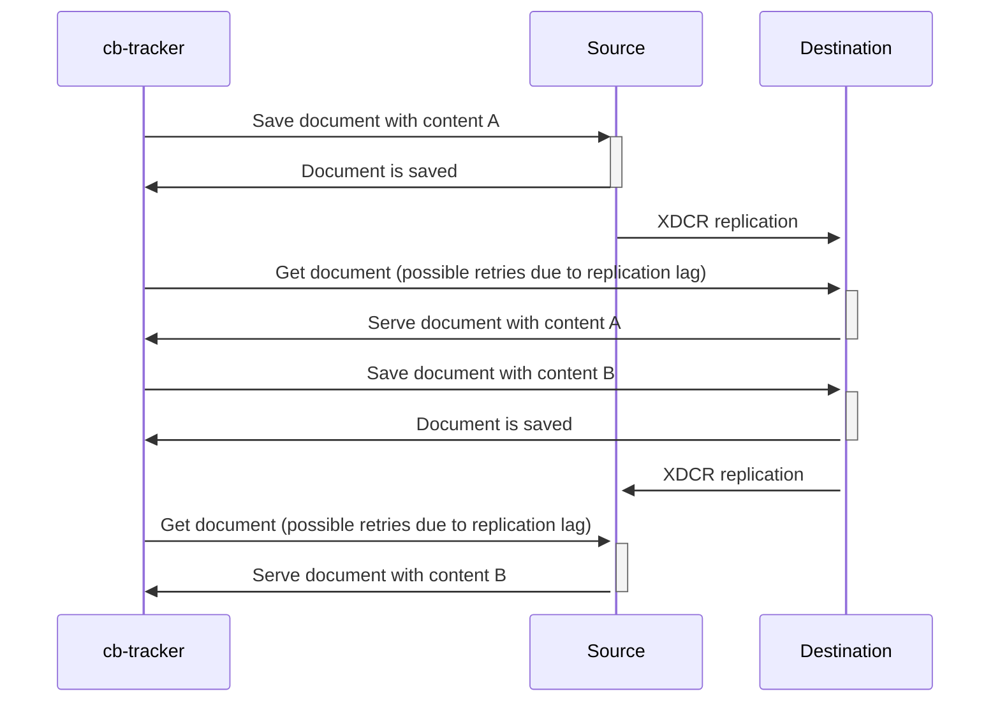
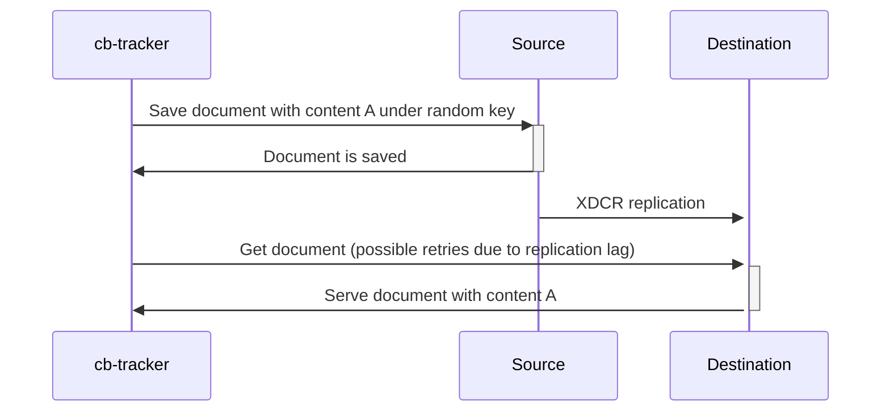
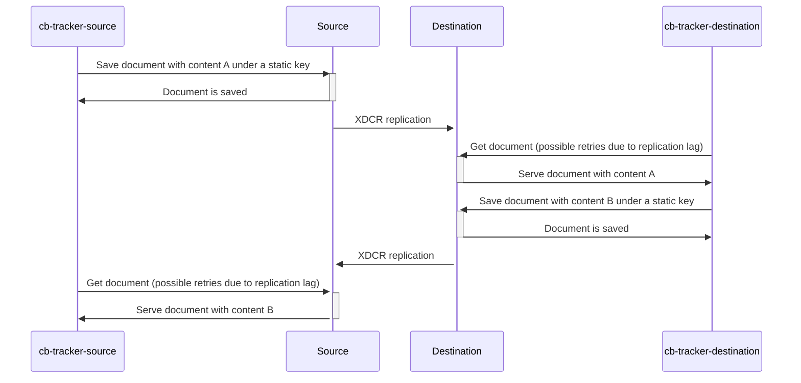

# couchbase-replication-ping a.k.a cb-tracker

Tool that allows to perform round-trip communication (write-read-overwrite-read) based on [XDCR](https://docs.couchbase.com/server/current/learn/clusters-and-availability/xdcr-overview.html) in order to measure replication latency in both directions simultaneously.

# Do you need a fast track to examine replication lag?

1. Prepare config that contains configuration that allows to connect to buckets: [example](./configuration/local.yaml)
2. There is ready to use docker:

```
CB_TRACKER_CONFIG=/path/to/your/config.yaml
docker run -v ${CB_TRACKER_CONFIG}:/config.yml -it ziollek/cb-tracker:latest oneway
```

for example to use config deliverer with repository just use below command (assuming that your pwd is root path of repository):

```
CB_TRACKER_CONFIG="$(pwd)"/configuration/local.yaml
docker run -v ${CB_TRACKER_CONFIG}:/config.yml -it ziollek/cb-tracker:latest oneway
```

Please check below information to know what else can you achieve and how to interpret command output.

## configuration file

The example configuration is presented below:

```yaml
source:
  uri: couchbase://localhost
  bucket: default
  user: default
  password: default
  name: src

destination:
  uri: couchbase://localhost
  bucket: default
  user: default
  password: default
  name: dst

generator:
  ttl: 150s
  size: 200

key: cb-repl-ping-document-key
```

source & destination keys has exactly the same structure and represents connection string to couchbase bucket, details are described below:

| key      | description                                                                |
|----------|----------------------------------------------------------------------------|
| uri      | couchbase url in format couchbase://[couchnase-host-ip-or-hostname]        |
| bucket   | bucket name                                                                |
| user     | credentials: username                                                      |
| password | credentials: password                                                      |
| name| name that is used internally to distinguished source & destinantion bucket |

additionally you can find here parameters that are used to generate documents while testing replication:

| key  | description                                                                         |
|------|-------------------------------------------------------------------------------------|
| ttl  | ttl of documents that are generated during tests |
| size | size in bytes of data field of documents that are generated during tests, it worth mentioning that document consists of several additional fields and are a little bigger than defined size|
| key  | depending of command it is key that is used for storing testing documents or prefix of documents key |


## what kind of tests/modes it supports?

### generic parameters for each kind of test

| parameter | type     | default | description                                        | 
|--------|----------|---------|----------------------------------------------------|
| interval | duration | 1s      | define interval between consecutive tests          |
| repeat | int      | 3       | define how many times test should be repeated      |
| timeout | duration | 10s     | define timeout for a single test                   |
| json   | flag     | false   | use json as an output instead colored text format  |

### ping mode - checks full round trip replication time

1. PING

   a. store -> Source -> replication -> Destination

   b. fetch <- Destination (with retires)
2. PONG

   a. store -> Destination -> replication -> Source

   b. fetch <- Source (with retires)

This mode is visualized be below sequence diagram:



#### example output

```
./bin/cb-tracker ping --config=configuration/local.yaml

INFO[2023-04-25 05:47:40] Using config file: configuration/local.yaml
INFO[2023-04-25 05:47:57] Start measuring latency: interval=1s, repeats=3600, timeout=10s
INFO[2023-04-25 05:47:57] ping                                          no=1 ping=4.940239ms pong=4.980409ms total=9.920648ms
INFO[2023-04-25 05:47:58] ping                                          no=2 ping=4.380505ms pong=4.678326ms total=9.058831ms
INFO[2023-04-25 05:47:59] ping                                          no=3 ping=4.281109ms pong=3.385059ms total=7.666168ms
```

#### interpretation

| field   | description                                  |
|---------|----------------------------------------------|
| ping    | time consumed by ping phase                  |
| pong    | time consumed by pong phase                  |
| total   | time consumed by whole operation             |
| retries | total number of retrying reads on both sides |
| err | error message |

### oneway mode - check detailed times consumed by unidirectional replication

One way is similar to ping but checks only one way replication lag (from source to destination).
It estimates lag by writing the document in a bucket defined as a source and tries to read it from a bucket configured as a destination.
The interpretation of the output is similar like for a half ping mode.

This mode is visualized be below sequence diagram:




### half ping mode - run two processes that connected only with one side (source or destination)

This approach allows to mitigate variety of RTT while connecting to both sides of replication from single host.

This mode is visualized be below sequence diagram:




### run

run as source part:

```
 ./bin/cb-tracker halfping --config=configuration/local.yaml source
INFO[2023-04-25 05:51:38] Using config file: configuration/local.yaml
INFO[2023-04-25 05:51:38] Start measuring latency from source perspective ...
INFO[2023-04-25 05:51:48] Start measuring latency from source perspective: interval=1s, repeats=3600, timeout=10s
ERRO[2023-04-25 05:51:58] source                                        error="context deadline exceeded" no=1 retries=4658 send=2.605072ms total=9.998339123s wait=9.995734051s
WARN[2023-04-25 05:51:59] source                                        latency=156.216766ms no=2 receive=2.319946ms retries=142 send=1.454013ms total=316.207492ms wait=312.433533ms
INFO[2023-04-25 05:52:00] source                                        no=3 receive=2.111094ms send=1.43418ms total=3.545274ms
```

run as source part:

```
 ./bin/cb-tracker halfping --config=configuration/local.yaml destination
INFO[2023-04-25 05:51:49] Using config file: configuration/local.yaml
INFO[2023-04-25 05:51:49] Start measuring latency from destination perspective ...
INFO[2023-04-25 05:51:58] Start measuring latency from destination perspective: interval=1s, repeats=3600, timeout=10s
INFO[2023-04-25 05:51:58] destination                                   no=1 receive=2.81849ms send=1.715289ms total=4.533779ms
INFO[2023-04-25 05:51:59] destination                                   no=2 receive=2.633771ms send=1.59923ms total=4.233001ms
```

#### interpretation

| field   | description                                                                                           |
|---------|-------------------------------------------------------------------------------------------------------|
| send    | time consumed by storing document                                                                     |
| receive | time consumed by reading phase                                                                        |
| wait    | time consumed by active waiting after storing document and between successfully read changed document |
| latency | estimated latency is computed only for test where wait phase was recorded                             |
| retries | total number of retrying reads on one side                                                            |
| err     | error message                                                                                         |


#### latency estimation in half ping mode

There is no direct way to measure replication lag from customer perspective, by lag can be estimated by using RTT and wait time.

Let's consider graphic example, where we assume that couchbase operation does not take any time and all lags are caused by network transmission.

```
Client-A     --\ /~~|~~|~~\ /--
ClusterDC-A  ---a---|--|---b--
REPLICATION  ---|===|--|===|---
ClusterDC-B  ---|---a--b---|---
Client-B     ---|--/ \/ \--|---
```

WHERE:

```
~           - wait time
=           - replication time
~ or - or = - it means that there was a clock tick
|           - point in time, it means there was not a clock tick
/ \ or \ /  - approx round trip time from track host to couchbase cluster
a,b         - document value
```

In such a simplified model we can easily assess latency using:
* RTT (round trip time) between host where the test is operated and couchbase host
* wait time - measured as the time between getting a response after writing the document and the time of sending the last (successful) read.

Considering the above example we can compute that:
* wait = 6 ticks
* RTT  = 2 ticks
* estimated latency = wait / 2 = 3 ticks

## remarks

Measured times are tightly connected with RTT time between the machine where the test is fired and both clusters/buckets.
If you want to achieve accurate results you should consider half-ping mode fired on hosts with little RTT to each side of testing buckets.


## Development

### run tests

```
make test
```
 

### build & run

```
make build
./bin/cp-tracker ping --config=configuration/local.yaml
```

notes: example config can be found in [configuration/local.yaml](./configuration/local.yaml)